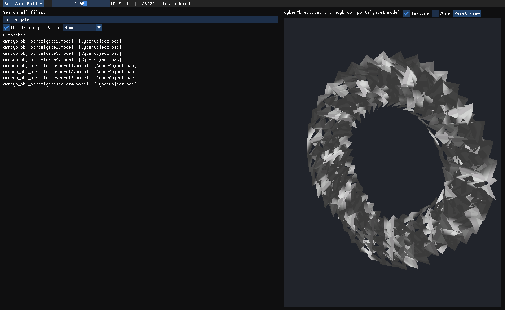
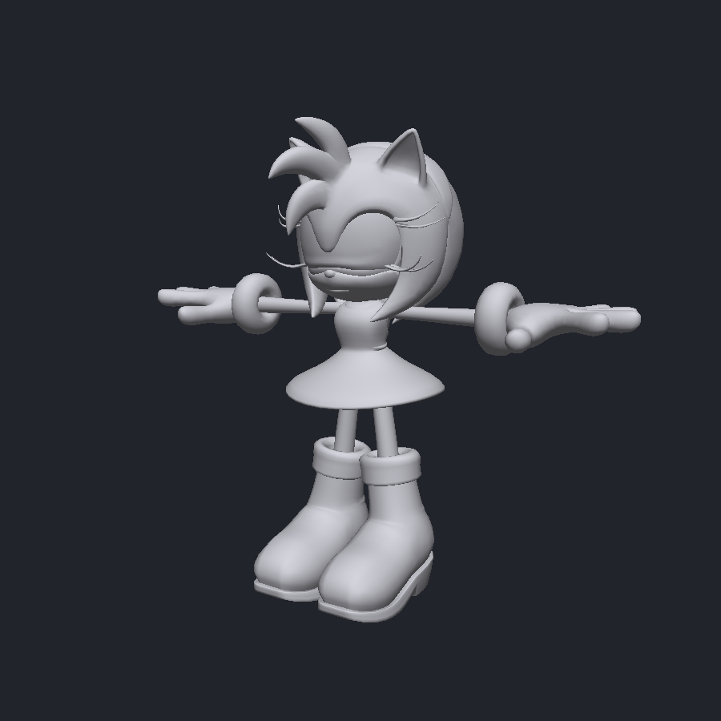
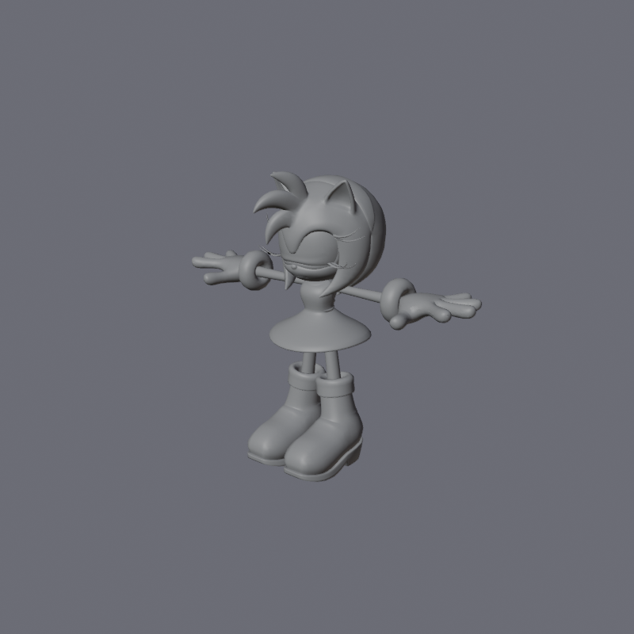

# Sonic Frontiers Extractor & Model Viewer

A Windows desktop tool (C++ / Dear ImGui / OpenGL) that **browses and extracts** Sonic
Frontiers' game archives, **renders its 3D models** in an interactive viewport, and
**exports models to binary FBX** with skeletons and skin weights.

Sonic Frontiers runs on Sega's **Hedgehog Engine 2 / "Needle"**. Its data is packed in
`PACx403L` archives containing LZ4-compressed, mixed-endian model/material/skeleton files.
This project reverse-engineers those formats from scratch and validates every parser against
the **entire retail game** (1,468 archives) and against Blender.



## Features

- **Archive browser** — the whole `image/x64/raw/` tree by category → `.pac` → contained files.
- **Global name search** across every file in every archive (~128k files, indexed in the background),
  with a **"Models only" filter** and **sort by name or type** so a model is one search + one click away.
- **3D model viewport** — orbit / pan / zoom, per-mesh textures (see *Textures* below), wireframe toggle.
  Triangle **strip vs list is auto-detected** per mesh (Frontiers' Topology flag is unreliable), so
  models render with correct topology instead of a scrambled mess.
- **One-click extract** of any contained file to disk.
- **FBX export** — binary FBX 7.4 with meshes, UVs, normals, vertex colors, a full armature
  (skeleton) and skin weights. Imports cleanly into Blender / Maya / 3ds Max.
- **"Set game folder" picker** with a persisted config, and a **UI scale slider** for 4K/HiDPI displays.
- A **statically-linked, single-file `.exe`** — no installer, no runtime, no DLLs to ship.

<p align="center">
  
  
</p>

*Left: a character rendered live in the app's OpenGL viewport. Right: the same model exported to
FBX and re-imported into Blender (170-bone armature, UVs, vertex colors, skin weights all intact).*

## Formats reverse-engineered

Everything below was cracked from the real files and documented in [`docs/research/`](docs/research):

| Format | Notes |
|--------|-------|
| **PACx v403** archive | Onion: `PACx403L` → LZ4-chunked root (`PACx402L`) → PATRICIA name tree; embedded LZ4 "split" blobs hold model/texture data. |
| **`.model` / `.terrain-model`** | Needle `NEDARCV1` wrapper → big-endian "Mirage" sample-chunk. **Two offset conventions** coexist (little-endian self-relative *vs* big-endian base-relative); auto-detected. Full D3D vertex-format table, triangle-list & strip topology, bone-palette skinning. |
| **`.material`** | Legacy Mirage (big-endian): shader, texture slots → DDS names + semantics, PBR params. |
| **`.skl.pxd`** skeleton | `PXSK` / BINA v2, little-endian; per-bone parent + local TRS bind pose. |
| **`.dds`** textures | Standard BCn (BC1/3/4/5/7) uploaded directly to the GPU. |

### Validation (whole retail game)

```
PAC archives   1468 / 1468   OK
models         19022 / 19022 OK   (skeletal + terrain)
materials       8657 / 8657  OK
skeletons       1450 / 1450  OK
```

FBX exports are checked by importing them headless into **Blender** (`bpy`) and asserting the
meshes, UV layers, vertex colors, armature bone count and per-vertex skin weights survived.

## Building

Requires **MSVC** (2019+) and **CMake** + **Ninja**. All other dependencies are vendored in
`extern/` (Dear ImGui, GLFW, stb, tinyfiledialogs, LZ4, glad) — no package manager needed.

```bat
build.bat            :: configures + builds Release into build\
```

or manually:

```bat
cmake -S . -B build -G Ninja -DCMAKE_BUILD_TYPE=Release
cmake --build build
```

Outputs `build\SonicFrontiersViewer.exe` (the GUI) and `build\sfcli.exe` (a headless CLI).

## Usage

1. Launch `SonicFrontiersViewer.exe`, click **Set Game Folder**, and pick your
   `steamapps\common\SonicFrontiers` folder (or its `image\x64\raw`).
2. Browse or search on the left. Click a `.model` to view it. Right-click any file to
   **Extract** or **Export FBX**.

### Headless CLI (`sfcli.exe`)

```
sfcli listpac <file.pac>            list contained files + histogram
sfcli model   <file.pac> [name]     parse a model, print mesh/vertex/bone stats
sfcli fbx     <file.pac> <name> <out.fbx>   export a model to FBX
sfcli batch   <folder>              parse every model/material/skeleton under a folder
```

### Screenshot hooks (for automation / CI)

The GUI can render itself to a PNG without opening a window:

```bat
set SFV_MODEL=<pac path>|<model basename>
set SFV_DUMP_PNG=out.png     :: render just the model
set SFV_DUMP_UI=ui.png       :: render the full app UI (needs SFV_GAMEDIR set)
SonicFrontiersViewer.exe
```

## Known limitations

- **Streamed textures (NTSI/NTSP).** Most *character* albedo textures aren't stored in the
  character `.pac`; they're stubs that stream from the big `texture_streaming/*.ntsp` packages.
  Those aren't resolved yet, so streamed characters render untextured. Textures stored inline
  as real `.dds` (many stage/prop/terrain assets) display correctly. Resolving `.ntsp` streaming
  is the top planned enhancement.
- **Animations** (`.anm.pxd`) are **not** exported yet. Frontiers compresses animation tracks
  with Nihilist's **ACL** library; the skeleton (bind pose) is fully supported, but decoding the
  ACL track data requires vendoring `acl` and is planned for a future release.

## Credits

Format research built on the shoulders of the Hedgehog Engine modding community — especially
**HedgeLib++** (Radfordhound), the **Hedgehog Engine 2 Blender importer** (Turk645),
**ModelConverter** (blueskythlikesclouds) and the **PXD animation tools** (AdelQ / WistfulHopes).
See `docs/research/` for exact citations.

## Legal

This is an unofficial, independent tool for use with a game you own. **Sonic Frontiers and all
its assets are © SEGA.** No game files are included in this repository, and you should not
redistribute extracted assets.

Licensed under the [MIT License](LICENSE).
